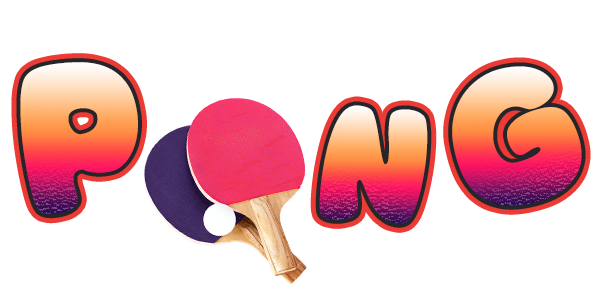
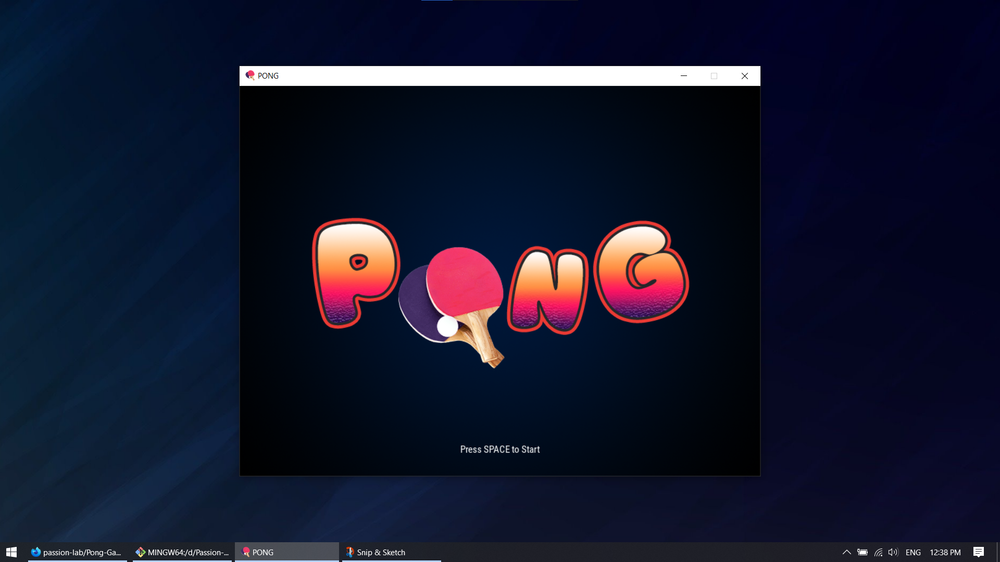
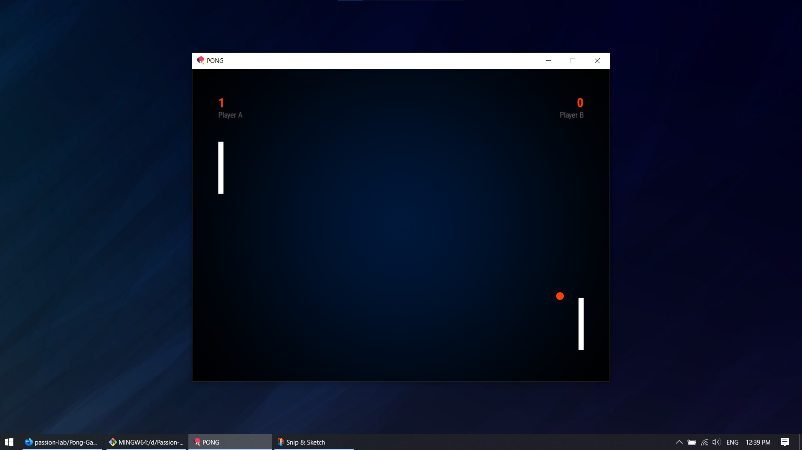
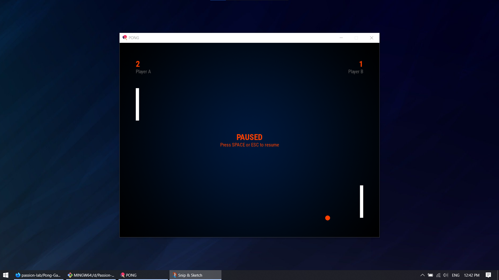
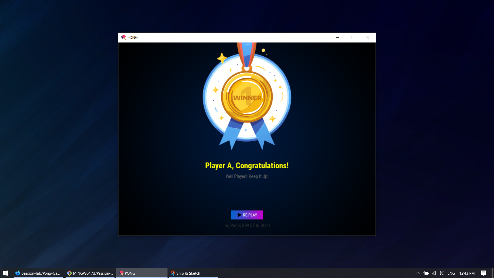

    

# Pong Game
> Brought to you by [Passion-Lab](https://github.com/passion-lab)

Pong Game or Table Tennis Game. This computer digital game is made with PyGame module and come with a very elegant looking design with sound effects to hold the players' attention while they engage in playing. Check the [screenshots (↓)](#screenshots) below.

|

    

|

### Game Features:
- **Stunnig visuals and graphics** made for a good looking and minimal UI.
- **Perfect sound effects** make every action lively.
- Can be played in **two different modes**:
  - **Single Player Mood:** One player can control the two Paddles (to hit the ball).
  - **Two Players Mood:** Two players in a single computer can control their own Paddles (to hit the ball).
- **Pause and Resume capibilities** at any time during the gameplay.
- **Countdown timer** included to get ready to hit again after a failure.
- **On-screen visible score** of the players to track their progress.
- **Game Over** facility on a total of 5 hit misses combining from both sides.
- **Encouraging winner board** for result deeclarations.
- **Replay button** at the result screen to start play again.
- ***Download and Play*** for a complete experience.

|

    

|

### How to Play?
Only by moving the two Paddles up and down to protect the ball from touching the left and right wall.
- For **Left Player**
  - `W` : Move the Paddle up.
  - `S` : Move the Paddle down.
- For **Right Player**
  - `↑` : Move the Paddle up.
  - `↓` : Move the Paddle down.
 

|

    

|

### Improvements:
- [x] Adding SFX.
- [x] Adding graphics to start, playing and end screens.
- [x] Using suitable fonts.
- [ ] Adding background music.
- [ ] Enabling to enter players' names before start.
- [ ] Adding ball grpahic.
- [ ] Adding the Paddles graphics.
- [ ] Taking playes' feedback.

|

    

|

## Screenshots:

    

Pong Game Start Screen <i>(by <a href="https://www.github.com/passion-lab">Passion-Lab</a>)</i>

    

Pong Game Running Screen <i>(by <a href="https://www.github.com/passion-lab">Passion-Lab</a>)</i>

    

Pong Game Paused Screen <i>(by <a href="https://www.github.com/passion-lab">Passion-Lab</a>)</i>

    

Pong Game Result/Score Screen <i>(by <a href="https://www.github.com/passion-lab">Passion-Lab</a>)</i>

|

    

|

### Credit(s):
 - [Passion-Lab](https://www.github.com/passion-lab)
 - [ChatGPT](https://chat.openai.com/)
 - [Python](https://www.python.org)
 - [PyCharm](https://www.jetbrains.com/pycharm/)
 - [VSCode](https://code.visualstudio.com)
 - [Git](https://git-scm.com/)
 - [GitHub](https://www.github.com)

<b>Pong Game</b> | Made with ❤️ by <a href="https://www.github.com/passion-lab">Passion-Lab</a>

